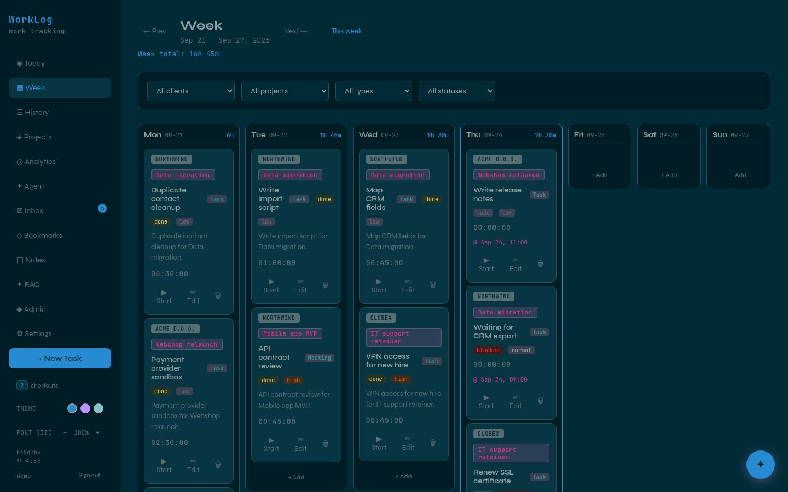
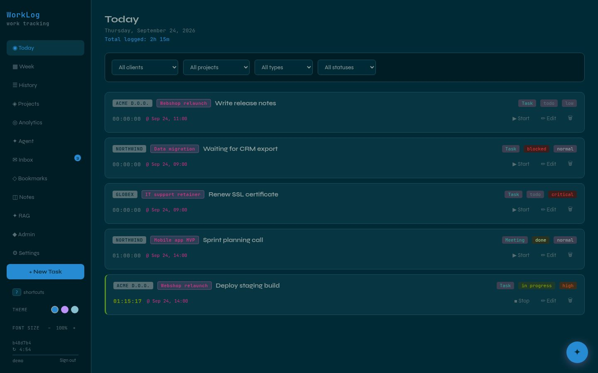
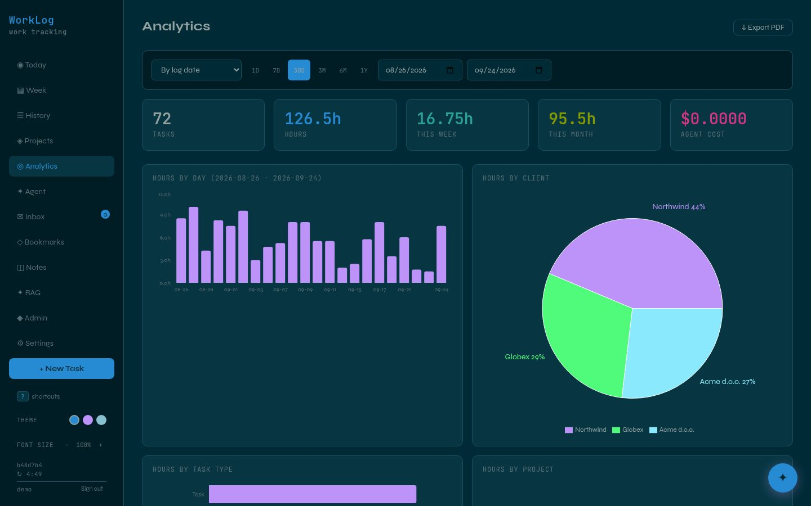
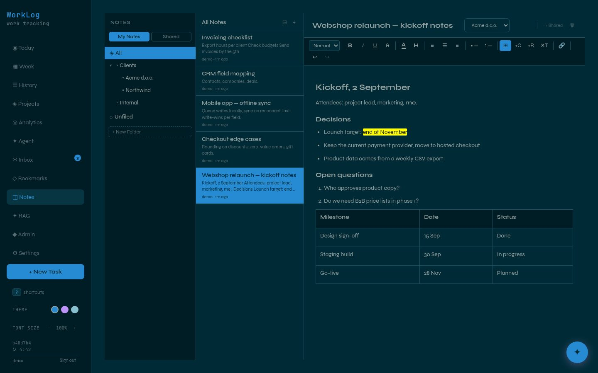
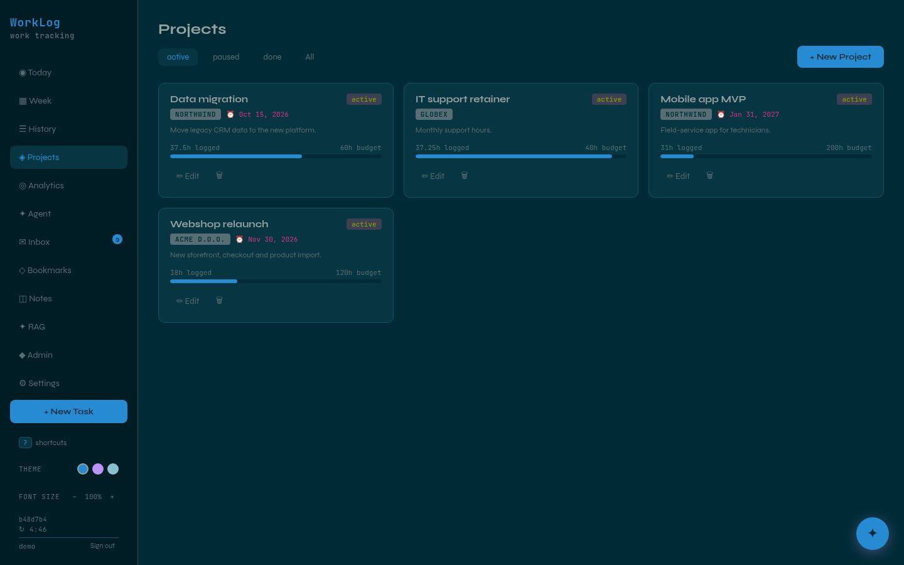

# WorkLog

**A self-hosted work tracker for freelancers and small teams.** WorkLog brings time tracking, projects, notes, bookmarks, an email inbox, an AI assistant and a searchable knowledge base into one privately hosted web app.

One process serves both the API and the interface. The interface can be installed as a PWA on desktop and mobile. Each user's data lives in their own SQLite database, and the AI features can run on a local model.



> Screenshots show a demo instance with sample data.

| Today with a running timer | Analytics |
|---|---|
|  |  |
| **Notes** | **Projects** |
|  |  |

## Features

- **Tasks and timers.** Log tasks against a client and project with type, status, priority and a scheduled date. A start/stop timer adds up time across sessions.
- **Today, week and history views.** A daily working view, a weekly rollup and a searchable history.
- **Projects.** Budgets, deadlines, and computed hours and status breakdowns per project.
- **Analytics.** Hours by day, client, task type and project, plus AI usage and estimated cost, all filterable by date range.
- **AI assistant.** Plain-language requests such as *"log 2 hours on the website deployment for today"* create and list tasks, change statuses and start or stop timers. Works with Anthropic, any OpenAI-compatible provider or a local Ollama model, and logs tokens, latency and cost for every run.
- **External tools over MCP.** The assistant can use tools from a remote MCP server (currently a product-documentation server) alongside its own. They go through the same tool loop, whichever model provider is active.
- **Email inbox.** Takes in emails that an external classifier has already categorised, with importance (1–5), a summary, a due-date hint and a suggested task. Filter by category, account or importance, mark as read or archive, and turn an email into a task through an editable draft.
- **Knowledge base (admin).** Upload text, Markdown, PDFs, audio, video or subtitle files. Audio is transcribed locally with faster-whisper, and everything is embedded into ChromaDB. A local model suggests tasks from the content and checks them against existing tasks for duplicates. You approve, edit or reject each suggestion, and you can chat with the knowledge base.
- **Notes.** A TipTap rich-text editor with nested folders, tables, colours and links, and auto-save. Notes can be private or shared, and a private note and its shared copy can be linked and synced by push or pull, with an in-sync / newer indicator.
- **Bookmarks.** Nested folders, private and shared collections, and preview cards built from a page's Open Graph data.
- **Multi-user.** The first user becomes admin. Admins create and deactivate users and issue long-lived API tokens for integrations.
- **Encrypted backups.** Admins can create AES-256 password-protected archives of all databases from the UI. The installer also takes a hot snapshot before every update.
- **Self-describing API.** A JSON and Markdown manifest of every endpoint, written for external tools and agents, alongside Swagger docs.
- **Keyboard-first.** Single-key navigation between views, and three themes (Solarized dark, Dracula, Nord).

## Tech stack

Python · FastAPI · aiosqlite · Pydantic · React · Vite · TipTap · Recharts · vite-plugin-pwa · SQLite · ChromaDB · Ollama · Anthropic API · OpenAI-compatible APIs · MCP · faster-whisper · pypdf · pyzipper · systemd

## How it works

```
React PWA ──▶ FastAPI (API + static UI)
                 ├── auth DB         users, API tokens
                 ├── shared DB       shared notes and bookmarks
                 ├── per-user DB     tasks, projects, private notes, settings, emails
                 ├── ChromaDB        knowledge-base embeddings
                 └── AI providers    Anthropic · OpenAI-compatible · Ollama · MCP tools

email classifier ──(API token)──▶ /api/emails
```

Authentication uses JWT for the browser and static tokens for integrations. The AI assistant runs its own tool-calling loop, so local tools and MCP tools look the same to every provider. Provider, model and key are chosen per user in Settings.

## Design principles

- **Data stays separate per user.** Each user has their own database file, and tasks, settings and knowledge-base content never mix.
- **Email is read elsewhere.** A separate classifier reads the mail with a local model. WorkLog receives only the structured result and a short excerpt, never a full message body.
- **Local where it matters.** Transcription and embeddings run on the server. Audio is never uploaded to a cloud service.
- **Back up before changing anything.** Every update takes a snapshot of the databases first.

## Availability

The source code is not public. WorkLog is available for licensing, custom deployment or white-label adaptation. Get in touch via [munda.si](https://www.munda.si/#contact).

## License

Proprietary. © 2026 MUNDA PLUS d.o.o. All rights reserved. See [LICENSE](LICENSE).

## Author

Built by [Marko Munda](https://www.munda.si/) · [Munda Plus](https://github.com/MundaPlus)
